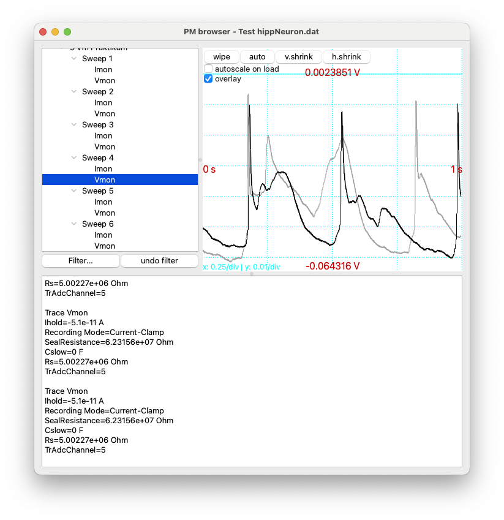

.. _intro-label:

What can :program:`PMbrowser` do?
---------------------------------

It can open bundled data files (:file:`.dat`) created by :program:`PATCHMASTER` or
:program:`PATCHMASTER NEXT`.

It has been tested with files created by versions of :program:`PATCHMASTER`
as old as v2.0, which is now more than 15 years old [#f1]_.

	You can browse the traces stored in the data file and comfortably access all *metadata*, such as Rseries, Rmem, Vhold, Amplifier state...
	You can select which metadata is relevant to you and should be extracted.
	

The second major function of :program:`PMbrowser` is the export of data (and also *metadata*) for use in :program:`IgorPro`
or :program:`Python/numpy` scripts. Also export as generic *raw binary* data is supported.

Features for export to :program:`IgorPro`:

	Traces can be exported either as individual Igor binary waves (:file:`ibw`-files) or several traces can be bundled into 
	a packaged experiment (:file:`pxp`-file).
	
	In case of export to :file:`pxp`-files, you can choose to have a folder
	hierachy created in the experiment that matches the structure (Experiment/Group, Series) in which the data was stored in the Patchmaster file.
	
	*Metadata* will be exported as wave-notes, so you will have all relevant metadata available in IgorPro.
	
Features for export to :program:`Python`:

	Traces are exported in :file:`npy` format. These can be read with the ``numpy.load()`` method of the :program:`numpy`
	package.
	
	Metadata will be exported in JSON format.

Is :program:`PMbrowser` free?
-----------------------------

:program:`PMbrowser` is open-source software. It is licensed under `GPLv3 <https://www.gnu.org/licenses/gpl-3.0.en.html>`_.
You can use it freely. The source code can be found `here <https://github.com/ChrisHal/PMbrowser>`_.

.. rubric:: Footnotes

.. [#f1] Note that :program:`PATCHMASTER NEXT`, which is the only
 variant under active developement by HEKA, cannot read data files created by old versions of :program:`PATCHMASTER`.
 One intention for the creation of :program:`PMbrowser` was to provide support for reading these old data files for
 users who now use :program:`PATCHMASTER NEXT`.
 