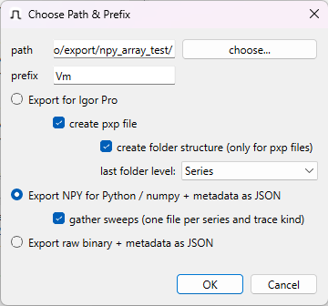

Usage
#####

The Menus
=========

"File"
******

'Open'
------

Select a :program:`PATCHMASTER` or :program:`PATCHMASTER NEXT` :file:`.dat` file. (Alternatively,
you can open a file by :index:`dragging <drag-and-drop>` it onto the :program:`PMbrowser` window. Non-bundled files, which consist
of a collection of various files, usually :file:`.pul` and :file:`.pgf` and possibly others
are also present.)

'Close'
-------

Close currently open file.

'Export...' Submenu
-------------------

Here you find options to export traces (available export formats: :file:`.pxp`, and
:file:`.ibw` for import by :program:`IgorPro`, :program:`numpy` format :file:`.npy` for import by :program:`python`,
and raw binary data) and metadata as a table.

When exporting traces and the choosen file format does not support inclusion of metadata, for each trace a :file:`.json` file
will be created that contains the exported metadata.

.. _export-all-visible-traces-label:

all visible traces
++++++++++++++++++

	All traces that are currently visible (i.e. not hidden)
	in the **tree-view** are selected for export. Traces can be hidden either by *filtering* (see
	:ref:`filter-menue-label` and :ref:`filter-dlg-label`) or by using the context menue of the **tree-view**.
		
.. _export-children:

selected with children
++++++++++++++++++++++

	All visible traces, that are children of the node currently selected in the **tree-view** are selected for export.
	This function also available from the context menue of the **tree-view** (*"export subtree"*).

The :ref:`export dialog <export-dlg-label>` will appear, which allows you to select paths and filenames as well as several options
that pertain to exports to packed experiment files (also see :ref:`igor-export-infos-label` for additional information on exports).

metadata as table
+++++++++++++++++

Export :index:`metadata <export; metadata>` as tab-delimited table.
Parameters marked for export (see :ref:`select-params-dlg-label` ) 
will be included in export. Additionally to these parameters, the first four columns of the table will contain
the group, series, sweep, and trace counts.

You can choose per which level of the pulse tree a table row should be 
produced.

Select Parameters
-----------------

Opens the :ref:`select-params-dlg-label`. There you can select which parameters from the PatchMaster-file
will be either *printed* to the **text-area** or *exported* as *wave-notes* and *tables*.

Preferences
-----------

Open *Preferences* dialog. Here you can configure how Imon and Vmon traces are labled.

"Edit"
******

'Clear Text'
------------

Clears the **text-area**.

"Tree"
******

.. _filter-menue-label:

'Filter'
--------

Allows you to hide unwanted nodes and traces from the **tree-view**, see :ref:`filter-dlg-label`.

'Show All'
----------

Un-hides all nodes and traces in the **tree-view**.

'Print All Parameters'
----------------------

Print all available parameters - including those not selected for printing - from the currently
selected **tree-view** item (trace or node) and its parents to the **text-area**.

(Also available from the context menue of the **tree-view**.)

"Graph"
*******

'Auto Scale'
------------

Set :index:`scaling <auto-scale>` of graph axes to extents of most recently loaded trace.

'Do Autoscale on Load'
----------------------

Toggle to enable or disable automatic scaling when a new trace is loaded
into the graph. Also avaible from the context menue of the :ref:`grapharea-label`.

'YX mode (cur. trace as X)'
---------------------------

Enter *YX mode*. The currently selected trace will be used a *X* reference for 
subsequent drawing operations. This is especially usefull if you are 
working with ramp stimuli.

.. _YT-mode:

'YT mode'
---------

Enter *YT mode*, which is the default mode. *Time* will be used as the abscissa for the graph.

'Wipe All'
----------

:index:`Clear <clear display>` the :ref:`grapharea-label`.

'Wipe Background Traces'
------------------------

Delete all displayed traces from the internal buffer of the graph. Only the current trace
will remain visible in the **graph area**.

'Settings and Ranges'
---------------------

Opens dialog which allows altering certain settings of the **graph area** - see :ref:`ranges-dlg-label`.

"Help"
******

'About'
-------

Displays 'About'-Dialog with various bits of information, including 
version of Qt-library against which the executable was build.

'About Qt'
----------

Displays dialog with information on Qt-library, including version of 
library actually used at runtime.

The Dialogs
===========

.. _export-dlg-label:

Igor Export: 'Choose Path & Prefix' Dialog
******************************************

This dialog is displayed every time you are about to export traces.

General options
---------------

	* *'path'* If multiple files are exported, this is the path they will be saved to. Use button *'choose...'* to call up a file dialog to choose the path (or enter a valid path manually).
	
	* *'prefix'* Exported waves will be prefixed with this text. If individual files are exported, they will have this prefix, too (since they will be named after the wave).

Selection of export method
--------------------------

All methods export additional metadata. See :ref:`select-params-dlg-label` for details on selection
of parameters to be exported as metadata.

Export for Igor Pro
+++++++++++++++++++

	* Checkbox *'create pxp file'*
		
		All waves will be exported into a single packaged experiment file (:file:`pxp`). After clicking *'OK'*, a file dialog will show up that allows you to select a filename for the file to be created.

	* Checkbox *'create folder structure'*
	
		If you export as a :file:`pxp` file, select this to create datafolders within the :file:`pxp` file that match the tree structure. You can choose if the grouping level for traces should be *group* or *series*.

Metadata will be included as wavenotes.

Export NPY for Python / numpy + metadata as JSON
++++++++++++++++++++++++++++++++++++++++++++++++

Each trace will be export as a :file:`.npy` file that can be read via ``numpy.load(<filename>)``. Metadata for
each trace will be export in JSON format (:file:`.json`).

Demo :program:`python` code showing how to use these files can be found in the Git repository
(folder `demo <https://github.com/ChrisHal/PMbrowser/tree/master/demo>`_).

Export raw binary + metadata as JSON
++++++++++++++++++++++++++++++++++++

Each trace will be export as a :file:`.bin` raw binary file. The data is exported as 64bit floating point.
Metadata for each trace, including samplerate, will be export in JSON format (:file:`.json`).

.. _filter-dlg-label:

'Tree-Filter' Dialog
********************

This dialog allows you to hide nodes and traces of the data-tree that you are not interested in. It can be accessed from the *Tree* menu
or via the *Filter...* button.
 
The filtering is based on *perl* style `regular expressions <https://perldoc.perl.org/perlre>`_. Only elements that match the given expression
will remain visible, all other elements will be hidden.

The expression ``.*`` will match any name, therfore you can use it to display all nodes of a given category.

See section :ref:`new-user-filtering-label` from the :ref:`new-user-tour-label` for an example how to use this feature.

.. _select-params-dlg-label:

'Select Parameters' Dialog
**************************

For each of the four tree levels *Group*, *Series*, *Sweep*, and *Trace* you can select which parameters
will be printed into the **text area** when a node is selected in the **tree-view** (checkbox *'print'*)
and / or added to the *wave-note* of exported traces and exported 
as metadata tables (checkbox *'export'*, cf. section :ref:`igor-export-infos-label`).

All paramters that might be of relevance should be available. If you miss something, please post a *feature request* 
on PMbrowser's `issues page <https://github.com/ChrisHal/PMbrowser/issues>`_. 

.. _relative-time-info-label:

Times can represented as :index:`relative times` (*Rel. time*). The time reference for calculation of the relative times
can be set using the context menu of the **tree-view**. By default, the reference time is the start time of the
:file:`dat`-file.

.. _ranges-dlg-label:

'Setting and Ranges' Dialog
***************************

Here you can configure the display area: axis ranges, *autoscale on load*, if grid lines should be displayed, colors
used for drawing traces and grid
and the number of overlay traces to be kept in the internal display buffer.
