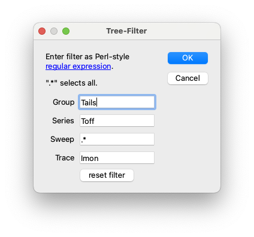
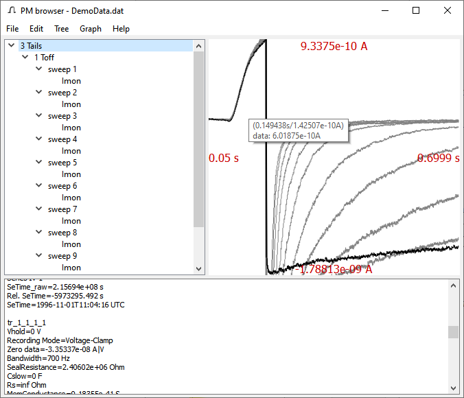
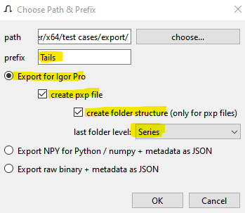

.. _new-user-tour-label:

#############
New User Tour
#############

We will take a quick tour around :program:`PMbrowser`, exploring typical use cases.

After successful installation (see :doc:`installation`), you can start PMbrowser via the start menue or from the Application folder.

You can open a PatchMaster (Next) :file:`dat`-file via ``File`` --> ``Open...`` or by simply dragging the file onto the application windows [#fflatp]_.
For this tour we will use the :file:`DemoData.dat` file provided with the PatchMaster installation.

The Application Window (overview)
=================================

The application window is divided into three sections, the *tree view*, the *graph area*, and the *text area* (see screenshot [#]_).

* The **tree view** represents the tree structure stored in the `dat`-file. *Groups* (or *experiments*, the file format treats both the same),
  *series* and *sweeps* are represented as nodes, *traces* from the final leaves of the tree. Elements for which a label is stored in the file
  are named accordingly. Elements without a valid lable are automatically named, e.g. *trace_1*, *trace_2* ...
  
  The nodes can be collapsed by a single mouseclick on the v-shaped symbol or hidden via the context menue: right-click on the node to be
  hidden and select menu item ``hide subtree``.
  A *double click* on any item will "play" all traces that a children of this item in the *graph area*.
  
* Inside the :ref:`grapharea-label` trace data will be displayed as soon as a trace has been selected in the *tree view*.
  Until then, it displays the text ``no data to display``.
  
* In the **text area** mainly metadata will be printed according to the element being selected in the *tree view*.

  The menuitem ``File`` --> ``Select Parameters...`` calls up the :ref:`select-params-dlg-label` which lets you choose for each
  level (*group*, *series*, *sweep* and *trace*) which metadata items :program:`PMbrowser` shall print and / or export.
 
 .. image:: Screenshot_tour_dlg_params.png
        :width: 650px
	:align: center
	:alt: dialog select parameters

Browsing Trace Data
=====================
	
Now let's explore some of the data. Click on some *traces* and / or double-click on a *series* item to populate the *graph area*.
(compare screenshot below).

You will realize that the graph auto-scales according to the last selected / added trace.
A certain number of "background" traces remains in an
internal buffer of the graph display. You can influence the storage and display of these
background traces and the autoscaling behavior (see below).

.. _new-user-filtering-label:

Selecting / Filtering Traces of Interest
========================================

Usually, we are not interested in all traces, e.g. leak traces might be less interesting.
Let's assume we want to specifically analyze traces from the **"Tails" experiment** stored in :file:`DemoData.dat`
that were done with the "Toff" protocol ( = **"Toff" series**). We are only
interested in the currents recorded, i.e. **"Imon" traces**.

Click the ``Filter...`` button to open the filter dialog. Change the *Group*, *Series* and *Trace* fields according to our
whishes (see screenshot). Click "OK".

	
Now all unwanted tree items and traces are hidden. Double-click on the tree item labled **"3 Tails"** to get a quick overview of the recording.
(The ``undo filter`` button  will bring back the hidden items / traces.)

Exporting Traces to Igor
========================

Now we want to export the traces that we selected in the previous step for further analysis in :program:`IgorPro`.

Select menu item ``File`` --> ``Export All Visible Traces for Igor...``. (All traces not hidden are considered visible.)
In the *Choose Path \& Prefix* dialog, we change the
**prefix** to *Tails*. The names of the exported waves will now start with "Tails\_".

	
Select the radio button "Export for Igor Pro" (not shown in image).

We want to create a single experiment file that contains all data. Also we want to create have datafolders according to the tree
structure in this file. Therefore we select "create pxp file" and "create folder structure". As last folder level we select "series".
This means that all sweeps and traces belonging to one series will be placed in one datafolder.
(Since we have only one group and one series to be exported, we could do without the datafolders. But for this
demonstration, we select this anyway.)

We do not change the "path", as this only important if we want to export a bunch of :file:`ibw` files.

Clicking "OK" takes us to a file dialog to select location and filename for the new :file:`pxp` file.

	
Open the :file:`pxp` file in :program:`IgorPro`. (Versions older then 5 will not work.) In the *Data Browwser* you will see the datafolders
and one wave for each trace.

In Igor's *Macros* menu you will find the item *Display Waves*. Select this to automatically create graphs for all series that you imported.

**Metadata** will be included in the *wavenotes* of the imported waves. ``File`` --> ``Select Parameters...`` in :program:`PMbrowser`
will bring forth a dialog that let's you choose which metadata-items to *export* in the wavenotes.

.. rubric:: Footnotes

.. [#] Screenshots may represent older versions of the software and differ somewhat from the current version.

.. [#fflatp] Drag'n'Drop is not yet suported for linux flatpak installations because of limitations of the Qt framework.
